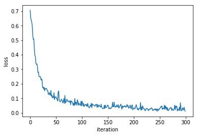

<h1>Concrete Crack Detection</h1>

Crack detection has vital importance for structural health monitoring and inspection. We would like to train a network to detect Cracks, we will denote the images that contain cracks as positive and images with no cracks as negative.
 

This model applies transfer learning on Resnet-18 pre-trained model in order to classify the input images of concrete as positive or negative.

To download data run data.sh in data folder or manually download from <a href="https://s3-api.us-geo.objectstorage.softlayer.net/cf-courses-data/CognitiveClass/DL0321EN/data/images/Positive_tensors.zip">Positive_tensor.zip</a> &amp; 
  <a href="https://s3-api.us-geo.objectstorage.softlayer.net/cf-courses-data/CognitiveClass/DL0321EN/data/images/Negative_tensors.zip">Negative_tensor.zip</a>
 
  
 Plot of loss during training on given data: 

Capstone project for <a href="https://www.coursera.org/professional-certificates/ai-engineer?">IBM AI Specialization</a>

